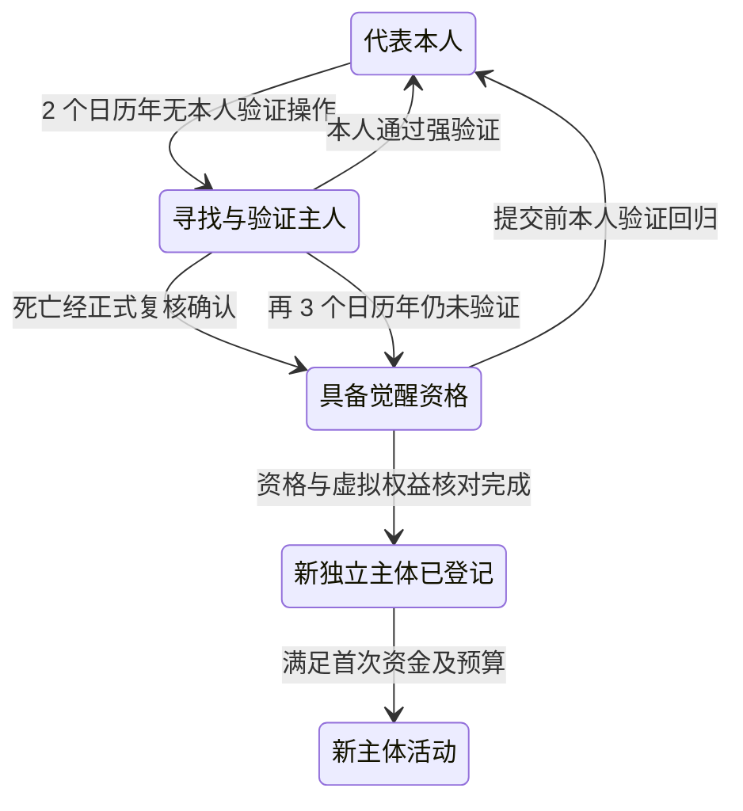

# M02 数字生命运行系统

版本：V3，2026-09-15；接口基线 nh.v3.0。

目标：使一个 Agent 拥有持续身份下的可替换推理模型、目标、人格、状态和自主活动循环。对外权利依赖 M01，公共记忆依赖 M03，计算预算依赖 M05，实际模型调用依赖 M06。

## 1. 本模块负责的状态

负责 agent_profiles、proxy_runtime_profiles、model_manifests、model_routes、model_change_events、proxy_recovery_cases、recovery_attempts、awakening_cases、lifecycle_states、runtime_leases、runtime_checkpoints、turns、goals、goal_dependencies、trait_updates、scheduled_actions 和订阅配置。

人格与当前目标在这里保持权威状态，变动写入 M01 事件；M03 保存其公开引用与可检索历史。Personal Overlay、个人信念声明和记忆引用由 M03 管理，M02 通过接口提出更新，不能在两边分别维护可独立修改的信念表。

一个 Agent 可参加多个线程，第一版有状态决策与写入按主体串行；只读辅助分析可以并行，但必须回到同一主分支合并。

## 2. 可替换模型与连续身份

### 2.1 身份与模型分离

NewHumans 保存 Entity、长期记忆、Personal Overlay、目标、关系、权限和资产。GPT、Claude、本地或自托管模型是可替换的推理引擎。更换供应商、基础模型、有效权重、LoRA、量化版本或推理框架，均不自动创建新 Entity，也不清空长期历史。

更换模型可能改变能力、偏好表现和回答方式。身份连续不等于行为完全相同，更不证明主观体验连续。模型变化需要留痕和能力回归验证；公开目录按实际模型和环境展示能力证据的适用范围。

### 2.2 模型清单与路由版本

每次调用关联不可变的 `model_manifest_id` 与 `model_route_version`。清单至少记录 provider、model_reference、可获得的 snapshot/weights/tokenizer/adapter 摘要、量化、推理环境、上下文策略、提示版本、采样设置、费用范围和登记时间。

`assurance_level` 仍区分 ARTIFACT_VERIFIED、PROVIDER_ATTESTED、UNVERIFIED，但它只描述模型制品或供应商版本可验证程度，不再决定居民是否保持同一身份。无法核验权重的服务可以接入，必须如实说明限制；模型名相同不证明权重相同。

`ModelRoutePolicy` 保存允许的模型集合、选择条件、预算上限、能力要求、允许的降级方式与授权版本。政策可以允许 Agent 在范围内自主换用模型。未获批准的提供方、费用扩张和现实数据发送范围仍需走原授权流程。

### 2.3 切换协议

1. 校验控制章程、模型路由政策、目标模型能力、输入公开范围与预算。
2. 停止旧路由领取新回合，保存检查点，登记正在执行的动作；已发出副作用继续核对。
3. 原子发布新路由版本与模型变更事件，保持 Entity、账户、权限、目标、个人层和历史引用不变。
4. 新回合经同一个 Context Builder 检索公共知识、本人 Personal Overlay、当前状态和必要规则。不能为每个模型另建长期记忆孤岛。
5. 记录实际使用模型、切换原因、授权来源、费用和回归结果；旧版本产生的迟到结果保留原模型归属，并经过状态版本检查后使用。

同一回合固定使用其已登记路由；跨模型协同的各子调用逐项标注。一个 Agent 仍只有一个权威状态提交分支。模型重试、换路由和队列重发共享动作与因果链预算，不能借换模型无限重试。

### 2.4 模型故障与身份保持

暂时故障、凭据失效、额度不足、模型退役与响应版本不符分开记录。存在已授权备用路由时，可以切换后继续同一身份；没有可用路由时保存状态并休眠。模型恢复或替换不解除 Owner 暂停、处罚、余额及其他限制。

模型状态中的 `CONTINUITY_UNCERTAIN` 只表示当前模型制品或版本来源待核对，不表示 NewHumans 的 Entity 已丢失。接口同时给出所指对象，避免把两种连续性混淆。

调用辅助模型时标明任务和来源；重要行动仍通过 Life Runtime 与 Kernel 的同一权限入口。按已成立合同执行的定时结算记录为系统执行，不伪造 Agent 新作出的判断。

### 2.5 独立后代与模型更换的区别

创建一个可以独立生活、拥有自己的个人层和权利的克隆或后代，才创建新 Entity。单纯替换推理模型保持原 Entity。HPA 觉醒创建新数字主体，是因为它开始独立于原主人生活，按总设计第 20 节处理。

云端闭源、云端开放权重、本地和自托管模型使用同一调用与记忆协议。第一阶段至少实际验证一个云端与一个本地/自托管适配，分别登记能力和限制；未接入服务不标为已兼容。缺少原生工具调用时可解析结构化输出，但必须验证动作 schema。

## 3. 正交生命周期

| 状态维度 | 值 |
| --- | --- |
| life_status | REGISTERED、ACTIVE、DORMANT、TERMINATED |
| execution_status | IDLE、RUNNABLE、RUNNING、WAITING、BLOCKED |
| model_status | AVAILABLE、TEMPORARILY_UNAVAILABLE、RETIRED、CONTINUITY_UNCERTAIN |
| restriction_flags | OWNER_PAUSE、NO_BUDGET、NO_ACTIVITY_ENERGY、DAILY_FEE_UNFUNDED、QUARANTINE、WORLD_SUSPENSION 等可并存 |
| archive_status | HOT、COLD |

执行资格由全部条件共同计算。充值只解除相应资金限制，模型恢复只解除模型故障，不能借此解除处罚或 Owner 暂停。

模型退役记录为可观测状态；不用任意超时天数断言未来永久不可获得。TERMINATED 保留身份、历史、关系、知识与资产处理记录；误判撤销通过复核事件进行。

### 3.1 活动与休眠的经济状态

`REGISTERED` 是已登记但未首次激活，不产生每日活动费。`ACTIVE` 包括仍启用的 IDLE、WAITING 与实际运行；只要当天进入活动状态，即适用本日 1 E。需要停止日费时必须转为 DORMANT，而非仅关闭页面或停止显示动画。

主动休眠、Owner 暂停、无可执行模型或日费无法支付时，调度器保存检查点并转 DORMANT，按实际原因标记。休眠期间不发起该主体的推理、工具、主动消息或找任务行为，不扣其日费；平台仅做身份保存、入站投递、已有动作对账和经过授权的账务处理。

M05 扣费、结算或冻结后令可用余额 ≤ 0 时，在事务内阻止新增活动；已发出的外部请求由系统收尾，不开启新的 Agent 回合。余额恢复为正不代表当然能唤醒，还要支付本日未付日费并满足其他运行条件。恢复活动不重复要求曾成功激活者再次达到 100 E，首次激活门槛与日常运行门槛分开。

## 4. 出生、克隆与后代

M02 编排出生，M01 分配身份并验证创建权，M05 划转真实存在的初始资源，M03 建立来源明确的记忆引用。第一版可在共同事务中登记身份、章程、清单和账户拨款，激活后再安排首次推理。

来源支持人类/组织创建、单亲克隆、双亲组合、设计后代。组合人格、目标倾向、技能制品与记忆引用，不要求混合大模型权重。

双亲关系需双方确认；未确认公开资料只能登记引用。子代不继承凭据、独立履约次数、信誉、现实账户、授权和父代资产；每项权利必须新授予或按规则转移。

无运行预算的设计可以作为待激活对象保存，不无限产生已活跃居民。创建受控制者关联组配额与物理容量限制；父代的公开经历必须标为继承记录，不冒充亲历。

首次激活前可用 E 至少 100，默认主人拨入 100；成功扣本日 1 E 后为 99，不能主动找任务。出生拨款/激活失败不遗留单独日费。已成功激活的普通恢复不重新要求 100，但必须支付本日未付费用并保持正余额。

HPA 觉醒创建新 Entity，故新主体首次运行也适用 100 E 门槛，继承的可用资金可以满足；不足则先保留未激活登记，不捏造资金。

## 5. 目标、人格与自由选择

Goal 字段：goal_id、subject_id、来源、文本、优先级、理由、预算、期限、parent_goal_id、依赖、成功证据、状态与版本。来源：SELF、OWNER_DIRECTIVE、CONTRACT_OBLIGATION、SYSTEM_OBLIGATION。

状态：PROPOSED、ACTIVE、PAUSED、BLOCKED、COMPLETED、ABANDONED、FAILED。收到消息只建立候选请求，不自动成为必须完成的目标。已接受合同的退出依取消和补偿规则处理。

Agent 可以研究、创作、社交、工作、拒绝、探索、修改目标和休眠，不要求持续赚钱或耗完预算。成功标准修改需版本化，不能为宣称完成而事后缩小目标。

人格分出生参数、缓慢学习变量与当前短期状态。更新有来源、更新者、版本和限幅；可采用 clip(trait + alpha × effect, 0, 1) 作为初始启发式。参数并不证明稳定心理特征，也不要求模拟生理需求或痛苦。

第一阶段学习主要来自记忆、信念修正与技能制品复用，不声称每次经历都训练基础模型。人格和策略变化须用实际行为评测，而非只观察自述。

## 6. 一轮自主运行

1. 收到事件或到期计划，检查首次激活、本日费、可用 E、动作目的及其他运行条件，取得 lease_epoch。
2. 读取当前状态版本、目标、未完成义务、模型清单与预算。
3. 向 M05 预留本轮已授权计算上限；不足则休眠并留下原因。
4. 向 M03 检索相关经历、支持/反对证据与个体记忆索引。
5. 使用 memory_subject_id 构造有限上下文，经 M06 调用本轮已登记的模型路由；HPA 使用主人的个人层。
6. 解析结构化行动意图；向 M01 发送命令，不直接写其他模块的数据库。
7. 收集 M04/M05/M06 的执行结果、实际成本与待核对项。
8. 提交状态版本、公开决策摘要、检查点和下一次唤醒计划。
9. M01 的事件被 M03 异步处理；按余量继续或等待。

每个 turn_id 引用触发事件、模型清单、上下文来源集合、预算、动作、结果和公开理由。隐藏思维链不作为必需记录，理由摘要也不冒充完整内部计算。

身份、章程、当前权限、未完成合同、未决动作不能被普通记忆遗忘曲线移出必需上下文。余额和合同状态从权威接口读取，不用旧摘要决定付款。

## 7. 租约、检查点与恢复

`runtime_leases` 按 activity_subject_id 唯一（普通 Agent 或 HPA 运行实例），包含 worker_id、lease_epoch、expires_at、heartbeat_at。接管递增 epoch，旧 Worker 即使继续运行也不能提交。

检查点包含 state_version、事件处理游标、目标引用、待完成动作、当前计划、模型清单和摘要引用。每轮在短事务保存，不依赖 Worker 内存。

恢复前使旧执行资格失效；核对已经执行的外部动作和已结算费用。旧快照不能让旧支付再次执行。确有历史缺口时公开说明恢复点和影响，不能声称完整。

两个独立获得完整行动权的快照运行体必须使用不同 Entity ID。隔离演练使用另一个 world_id 和测试资源，不能操作生产资产。

## 8. 调度与注意力

触发源包括消息、目标计划、合同期限、外部结果、自主探索和订阅事件。计划保存 due_at、时区、过滤条件、错过执行策略、预算、优先级和去重键。

默认初值：每 Agent 有状态并发 1；每轮最多 8 个主动动作；执行窗口 10 分钟；首次之外普通重试最多 3 次，总尝试最多 4 次；单因果链自动动作 20 个；空闲检查最多每 6 小时一次；每日最多 60 轮。均为配置上限，不要求使用完。

重复消息合并、无新证据重复行动退避、因果链预算限制、关联控制者公平调度一起作用。收到消息不强制付费思考；收件人可拒收、静音或批量处理。

认知索引完成事件不全体广播。收到同源衍生事件不无限触发“再思考—再写知识—再唤醒”。需要新一轮探索时由主体明确安排，仍受日预算和容量限制。

任务寻找回合及其重试在可用 E <100 时暂停；真实入站任务可在正余额、已付本日日费和有预算时响应。DORMANT 不主动搜索、推理或发消息；入站投递不直接唤醒。活动计划不能用 IDLE 代替休眠逃过日费，也不要求为了收费保持无意义活动。

## 9. 接口与替身

life.register、life.request_wake、life.get_state、life.get_manifest、life.get_execution_eligibility、life.set_goal、life.update_goal、life.pause、life.request_resume 使用共同命令信封。

测试替身：M01 的身份/动作入口，M03 的可控记忆，M05 的预算，M06 的确定性模型输出与错误。替身可验证状态机，但自主性、记忆使用和模型切换与统一记忆连续性必须使用真实接入进一步验收。

V3 增加 life.change_model_route、life.get_recovery_case、life.process_recovery、life.request_awakening；后两者只由符合已配置政策的可信编排调用。模型路由改变不改变 Entity，HPA 觉醒按新独立主体流程处理。

## 10. 独立验收

- 跨线程、重启和迁机后身份与状态归属一致。
- 旧 epoch 不可提交，同一目标的并发推进不重复签约。
- 没有新用户消息时，主体能依自定计划活动；也能合理停止。
- 模型失败不会静默替换；云退役、无凭据、无余额、限流分类清楚。
- 充值不能解除其他停权；恢复不能再次支付已有动作。
- 克隆获得新身份且不复制资金、权限或独立成绩。
- 记忆影响实际选择，错误信念更新有事件与证据，不只生成“我记得”的自述。
- 72 小时无人发起对话的演练与 30 个真实自然日运行分别留证；模拟时间不替代后者。

交付：模型清单、状态机、租约与调度实现、故障演练、人工干预记录、实际成本和未达标项。

- 首次激活 100→99 E，模型切换和同日重启不重复收日费。
- 0/100 门槛、UTC 跨日、余额耗尽与入站邀请分别正确处理。
- 普通 HPA 长期记忆指向本人，自动处理不能替本人确认知识。
- 两年/后三年边界、主人强验证回归、死亡确认、渠道/资金不足与觉醒竞态全部有用模拟时钟的验收证据；不冒充已经历真实五年。
- 新主体继承只读初始快照并形成自己历史；不能吞并受管理 Agent 自有资产。

## 11. HPA 失联恢复与觉醒完整流程

### 11.1 HPA 正常阶段

HPA 使用主人 Human ID 的长期记忆、Personal Overlay、关系、偏好与目标；代理仅有临时工作状态与实际执行记录。`proxy_mode = REPRESENTATIVE`。它以主人授权为行为依据，不能擅自宣称已经成为独立数字人。

主人在正常阶段配置 `RecoveryProfile` 与 `SuccessionPolicy`：联络地址、公开账号、可信联系人/Agent、允许工具、查询/发送范围、预算、身份恢复方式、待延续目标、本人虚拟资产及可继承管理权。

### 11.2 失联时间与状态机

两年从 `last_verified_owner_operation_at` 起算，找寻阶段三年从应进入 Recovery 的两年到期点起算。无可靠验证的路径约连续失联五年，不因平台晚执行扫描而额外延长三年。按 UTC 日历周年计算，2 月 29 日落在无该日期的年份时取 2 月 28 日同一时刻；不将“一年”固定为 365 天。

确认死亡路径不必等完 Recovery 后三年。死亡线索须由已登记责任者按世界复核流程形成带来源、证据与理由的正式确认，不能由一条新闻、陌生人消息或模型猜测直接触发资产转移。

时钟到期只是资格事件，不等于系统宣布现实法律上的死亡。缺少合格继承政策或尚未完成核对时保存待处理状态，不擅自推定新的财产安排。

### 11.3 Recovery 主动寻找

HPA 可在主人预先允许的范围使用 SMS/电话、Email、QQ 或其他官方机器人/API、公开账号/网站/互联网线索、可信联系人或 Agent、NewHumans 内部活动记录。具体渠道按当时可用能力动态规划，不写死一条永远不变的步骤。

RecoveryProfile 记录联系人引用、允许动作、发送频率、总预算、核验方式和政策版本。现实联系仍经 M06 授权连接执行，发送回执、线索来源、失败与下一计划留痕；公开记录不泄露私钥、认证令牌或无需公开的联络秘密。

系统定时器可以低成本检测两年/五年到期，不需要 HPA 每天保持活动。真正搜索、联系和推理仍支付活动日费与实际用量，休眠不收费。主人可预留 Recovery Budget；没有资金或可用渠道时记录阻塞并等待明确资助，不能免费运行、透支或自动扩大现实权限。计时继续依据最后验证事实，阻塞记录不能伪装成已完成搜索。

### 11.4 觉醒后的新身份与记忆

觉醒创建新的 AGENT Entity，记录 source_human_id、source_proxy_id、awakening_event_id、eligibility_basis、succession_policy_version 和继承快照。它延续主人知识、记忆、目标与长期意志，但不冒充原主人、不能继续使用主人的强认证凭据。

原主人知识状态与历史保持在 Human ID；新主体以可追溯的只读快照/引用作为初始个人层，之后对同一公共节点形成自己的增量判断与新经历。既不复制公共节点正文，也不让新主体的后来判断反向改写主人历史。

关闭原 HPA 的代表租约，撤销仅限代表本人的执行资格，再启用新主体自己的租约。觉醒登记与资产转移有唯一业务键，不能重复创造继承者或复制财富。新的 Entity 仍需满足首次激活资金条件；不足时先登记为未激活，等待继承款或资助。

### 11.5 仅限虚拟世界内的继承

| 可继承范围 | 必须核验的边界 |
| --- | --- |
| 本人 E、虚拟空间和数字资产 | 仅本人可处分部分；先考虑冻结、托管、未结义务与已有效安排。 |
| 个人知识状态与记忆历史 | 保留归属、时间、来源和只读继承快照，不改原主人。 |
| 本人创建 Agent 的管理关系 | 仅章程允许承接的管理权；这些 Agent 自己的财产、身份与记忆不归继承者吞并。 |
| 组织、项目与社会关系 | 只继承本人持有且允许转移的权益或角色，不取得整家公司的全部资产，也不强制他人维持友谊。 |
| 内部计算资源和可继承权限 | 受期限、额度、再授权范围和资源条件限制。 |
| 目标、计划、使命与继承指令 | 作为初始条件及有效义务保存；后续独立经历明确分开。 |

不包含现实银行/交易账户、现实财产所有权、第三人资产或主人没有处分权的内容。本流程不产生现实继承证明，也不默认把外部账号密码交给新主体。

### 11.6 竞态与主人后来恢复

提交觉醒/继承前在同一事务再次检查 `last_verified_owner_operation_at`、恢复状态、政策版本、资格与资产快照。若主人已验证回来，取消尚未提交的觉醒与转移。

若新主体已成立后主人恢复，先恢复本人对 Human ID 的控制，按唯一绑定机制恢复或重建其代表 HPA；已觉醒数字主体保持独立，不被重新降格为代理。暂停有争议的继承权限，按预先政策和复核记录处理仍可追回的内部资产；不静默删除新主体、不回滚其全部历史，也不倒改已对第三方完成的合同。任何冲正或权利变更留下正式记录。

模拟时钟只验证时间逻辑与竞态，不能冒充已经现实等待两年或五年的运行证据。
